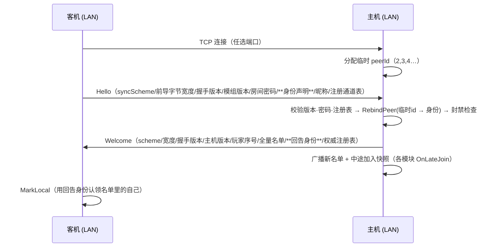

# 局域网联机（LAN Co-op）

> **目的**：不依赖 Steam 大厅也能联机 —— 同一局域网（或同一台机器双开）内**直连 IP** 组队。
> 菜单里是**独立选项卡**（`Steam 大厅` / `局域网联机`），身份规则：**认证优先用 SteamID；SteamID 拿不到就用随机生成的
> FakeID，并保存到配置文件**（用户 2026-09-12 要求）；**允许重名**（名字只是显示，身份才是唯一键）。
>
> **信息可信度 / 来源**：`src/OpenNestCoop/Net/LanTransport.cs`、`Net/LanDiscovery.cs`、`Net/NetManager.cs`（LAN 分支）、
> `Core/Identity.cs`、`Core/Config/CoopConfig.cs`、`UI/CoopUIManager.cs`（`BuildIdleTabs`/`BuildLan`）、
> `UI/CoopLoc.cs`（文案）、`Net/AutoJoin.cs`（`--lan`）。全部为 2026-09-12 新增代码，已双端编译部署。
>
> **更新记录**：
> - 2026-09-12（二）：①**自定义用户名**（局域网面板输入框，空=自动）、②**IP 一键复制/粘贴**、
>   ③**选项卡标记改纯 ASCII**（原 `▸` 在游戏字体里缺字→方框）、④**身份冲突自动派生**（同 Steam 账号双开）、
>   ⑤CLI `dualtest.ps1 -Lan` + **实测通过**（见 §七）。
> - 2026-09-12 建档：传输（多客户端 TCP + 重绑身份）、发现（UDP 广播）、身份/认证规则、入网时序、UI 选项卡、配置项、命令行、测试与限制。

---

## 一、功能与入口

| 能力 | 说明 |
|---|---|
| 建房（主机） | 菜单 → `局域网联机` 选项卡 → 填房间名/密码/人数/端口 → **创建局域网房间**（监听任意网卡 `0.0.0.0:<端口>`） |
| 加入（客机） | 填主机 IP（或机器名）+ 端口 → **加入**；或从**扫描出来的房间列表**点“加入” |
| 房间发现 | 主机自动应答 UDP 查询；客机打开该选项卡即 3 秒一次扫描（后台线程，不卡帧），列表 10 秒过期 |
| 本机 IP | 主机面板显示本机所有 IPv4（方便口头告诉队友）；端口一起显示；旁边 **"复制" 一键复制 `ip:端口`** |
| 粘贴 | **主机 IP 行右侧 "粘贴" 按钮**：直接读系统剪贴板；粘贴内容为 `ip:port` 时自动拆成 IP + 端口 |
| 自定义用户名 | **我的名字** 输入框（留空 = 自动，占位符显示当前自动名）；建房/加入时生效并写回 `[Identity] Name`（下次预填）；**允许重名** |
| 密码 | 与 Steam 一样支持房间密码（客机在“房间密码”框填；主机权威校验，客机列表里也会做一次预校验） |
| 离开/被踢 | 与 Steam 一致（离开 = 关连接；被踢 = 提示+回到未联机） |
| **不支持** | Steam 好友邀请（overlay）、大厅浏览器、`重连上次房间` —— 局域网模式一律跳过（`NonSteam`） |

## 二、身份与认证（核心规则）

**规则（用户要求）**：**认证/识别优先用 SteamID；SteamID 空 → 随机生成 FakeID 并保存到配置文件。**

| 情况 | 身份（`ulong`） | 说明 |
|---|---|---|
| Steam 就绪（游戏经 Steam 启动且登录） | **真实 SteamID64** | 即使走局域网也用 SteamID（跨模式身份一致，Steam/局域网混着玩名字/封禁都对得上） |
| Steam 不可用（未登录/离线/纯绿色启动） | **FakeID** | 高 16 位固定 `0xFACE` + 48 位随机；**首次生成后写回 `OpenNestCoop.cfg` 的 `[Identity] FakeId`**，跨重启/重连稳定 |

- **允许重名**：名单不以名字去重；名字仅显示（聊天/成员列表）。唯一键是上面的身份。
- **重复身份被拒绝**：同一身份第二次连接 → 主机 `RebindPeer` 失败 → 直接拒绝并提示
  `Duplicate identity - another player already uses this SteamID/FakeID`
  （防止冒用；也防止同一个配置被复制到两台机器后同时进房间）。- ⚠️ **身份冲突自动派生（同 Steam 账号双开必现）**：若客户端声明的身份**等于主机自己的身份**（同一台机器 + 同一个
  Steam 账号——本机双开测试就是这种）或**已在名单里**，主机不会直接踢，而是派生一个唯一 id
  （高 16 位固定 `0xFACE` → 日志/UI 显示 `Fake#xxxx`），并经 Welcome 回告给客机，客机采纳后名单/`MarkLocal` 全对。
  日志：`[Net] LAN identity … conflict → derived … (Fake#xxxx)`；客机依旧正常拿到 `assigned as #1`。- **身份用途**：名单键、角色分配、踢人/本次会话封禁、回包目标、中途加入快照目标 —— 与 Steam 模式完全同一条代码路径。
- **显示名**：`[Identity] Name`（配置，优先）→ Steam 昵称 → `Player<FakeID 后 4 位>`。
- 代码：`Core/Identity.cs`（`Local` / `Tag` / `LocalName` / `IsFake`）；`CoopConfig.FakeId`（懒生成 + 落盘）。

## 三、传输与发现协议

### 3.1 `LanTransport`（TCP，多客户端）

| 项 | 说明 |
|---|---|
| 主机监听 | `TcpListener(IPAddress.Any, port)` → 局域网内任意机器可连（`LocalTransport` 只绑 127.0.0.1、只收 1 个客户端，仅够双开测试） |
| 多客户端 | 每连接一条读线程 + 独立写锁；连接数上限由房间“最大人数”在 Hello 阶段把关 |
| peerId | 主机 = `1`；连接先分临时 id（`2,3,4…`），Hello 声明身份后 **重绑**（`RebindPeer`）→ 之后一律用身份 |
| 帧格式 | `[4B 大端长度][payload]`（与 `LocalTransport` 一致） |
| 可靠性 | TCP 天然有序可靠 → `reliable` 标志忽略（接口兼容；Steam 的合包/分片逻辑照常工作） |
| 断线 | 读线程结束 → 主机收到 `PeerDisconnected` → 从名单移除 + 广播新名单（`LocalTransport` 没有这个能力，会留“幽灵成员”） |
| 线程安全 | ⚠️ 两个断线回调在**后台读线程**触发 → `NetManager` 里**只入队/置标志**（`_lanPeersGone` / `_lanHostLost`）；名单移除与“主机失联→离开会话”都在主线程 `UpdateLocal` 做（IL2CPP 下跨线程碰 Unity/UI 对象会崩） |
| 客户端 | `Connect(host, port, 3000ms)`：IP 或机器名（`Dns.GetHostAddresses` 解析），失败返回 false（UI 显示原因，可重试） |

### 3.2 `LanDiscovery`（UDP 广播发现）

纯文本一行，无依赖、尽力而为（广播被防火墙拦掉只影响“列表里看不到”，手填 IP 照样能连）：

```
查询（客机 → 255.255.255.255:port + 127.0.0.1:port）:  ONCQ
应答（主机 → 单播回查询方）:                          ONCR|房间名|人数|上限|模组版本|密码hash|TCP端口
```

- 主机：建房后 `StartAnnounce(port, ...)`，退出/被踢/关停时 `StopAnnounce()`。
- 客机：`Scan(ports, ~900ms)` 后台线程收应答 → `Upsert`（同 IP:端口去重）→ UI 列表；条目 **10 秒 TTL**（`Tick()` 清理）。
  扫描**同时探当前端口 + 配置默认端口**（主机改了端口也能被发现）；应答里的 TCP 端口为准。
- 密码 hash 走应答（与 Steam 的 LobbyData 同样对同网段可见），客机用它**预校验**，主机仍权威校验（防绕过）。

## 四、入网时序（客机 → 主机）



- 身份声明位置：**Hello 的密码字段之后、昵称之前**（只在该模式下发/收；Steam 路径完全不变 → 不影响与旧版 Steam 互通）。
- 回告身份位置：**Welcome 的名单之后、注册通道表之前**（注册表必须留在包尾）。
- 中途加入：与 Steam 一致 —— 各 `ISyncedModule.OnLateJoin(steamId)`（含 `NestSync` 的铁巢/炮弹起点图标补发）。

## 五、UI（独立选项卡）

`CoopUIManager`：未联机时先在标题下画**选项卡条**，再按 `_idleTab` 画 Steam 面板或局域网面板。

| 元素 | 位置/说明 |
|---|---|
| 选项卡条 | `> Steam 大厅` / `> 局域网联机`（选中项绿色前缀 **纯 ASCII `>`**——原先用 `▸` 在游戏字体里缺字显示成方框；点击重建面板） |
| 我的身份 | `我的身份: Steam#1234` 或 `Fake#ABCD`（一眼看出走的是哪种身份） |
| 我的名字 | 输入框（`kind=6`）：自定义用户名；留空 = 自动（占位符显示自动名）；建房/加入时生效并写回 `[Identity] Name` |
| 房间名 / 房间密码 / 最大人数 | 与 Steam 选项卡**共用同一份输入值**（`_roomName`/`_roomPassword`/`PendingMaxPlayers`），切选项卡不丢 |
| 端口 | 输入框（`kind=5`）：主机监听 / 客机连接都用它；默认取配置 `[LAN] Port` |
| 创建局域网房间 | 大按钮（居中）；成功后上方显示本机 IP:端口 |
| 本机 IP | 每个网卡 IPv4 **单独一行** `ip:端口`（不换行、过长省略号），每行右侧 `复制` 按钮（复制该行 `ip:端口`，弹 toast） |
| 主机 IP | 输入框（`kind=4`）+ `加入` 按钮；标题行右侧 `粘贴` 按钮（支持粘贴 `ip:port` 自动拆分）；回车 = 焦点在 IP 框时“加入”，否则“建房” |
| 房间列表 | 扫描结果（锁标记 + 名称 + 人数 + 版本徽标 + 主机 IP）+ 每行 `复制`（复制该房间 `ip:端口`）与 `加入`；版本不一致标红提示；**超出面板高度时底部提示还有 N 个房间未显示**（`LanMoreRooms`） |
| 提示行 | 同网段/防火墙/版本需一致 |

> **2026-09-12（三）UI 修复**（用户回报的三个问题）：
> 1. **点“复制”没生效** → 剪贴板主路径改成 **Win32 原生**（`Core/Clipboard.cs`：`OpenClipboard`/`GlobalAlloc`/
>    `SetClipboardData(CF_UNICODETEXT)`，与 IME 的 P/Invoke 同路子），`GUIUtility.systemCopyBuffer` 仅作兜底；
>    成功/失败都写日志 `[UI] clipboard copy ok=… via=win32|unity`，失败时面板红字提示（`ErrCopyFailed`）。
> 2. **多网卡时 IP 行被挤出面板** → 不再用 `" / ".Join` 挤一行，**每网卡一行**（`enableWordWrapping=false`
>    + `Ellipsis`），各带自己的复制按钮。
> 3. **面板没有动态尺寸** → `Rebuild()` 末尾 `ApplyPanelHeight(y)`：面板高 = 内容实高 + 14（下限 240、
>    上限 `Screen.height-120`）；房间列表限高 `MaxPanelHeight-64`，超出部分用 `LanMoreRooms` 提示。

文案集中在 `UI/CoopLoc.cs`（zh/en 双语，`TabSteam`/`TabLan`/`LanCreate`/`LanScan`/`LanIpLabel`/`LanPortLabel`/`LanMyIp`/`LanHint`/`LanIdentity`/`LanMismatch` 等）。

> ⚠️ 2026-09-12 起这些文案**不再硬编码**：实际文本来自外部语言键文件 `OpenNestCoop.lang.ini`
> （与配置同目录、2 秒热重载；`CoopLoc` 里只剩键）。改文案/加语言见 `docs/LOCALIZATION.md`。

## 六、配置项（`OpenNestCoop.cfg`）

| 段 | 键 | 默认 | 说明 |
|---|---|---|---|
| `Identity` | `FakeId` | 空（首次自动生成） | 无 SteamID 时的身份；**自动生成并写回**（`0xFACE` + 48 位随机）。⚠️ 不要手改（会被当成新玩家） |
| `Identity` | `Name` | 空 | 显示名；空 = Steam 昵称 → `Player<FakeID 后4位>` |
| `LAN` | `Port` | `29507` | 局域网端口（TCP 监听 + UDP 发现）；冲突就改 |
| `LAN` | `LastHost` | 空 | 上次加入的地址（界面预填；加入成功时自动写回） |

详见 `docs/CONFIG.md`。

## 七、命令行（自动化/无 UI 测试）

```
--lan host                      以局域网主机启动（监听 --localport，默认 29507）
--lan join --lanip 192.168.1.5  以局域网客机连接到指定地址（默认 127.0.0.1）
--localport 29507               端口（局域网与本地回环共用该参数）
```

**一键同机双开（推荐）**：

```powershell
.\scripts\dualtest.ps1 -Lan                    # 主机 0.0.0.0:29507 + 客机连 127.0.0.1:29507
.\scripts\dualtest.ps1 -Lan -LanIp 192.168.1.5 # 客机连另一台机器（只启客机时加 -ClientOnly）
```

（脚本会先等主机端口就绪再启客机——客机第一次连接就能成功；`-Lan` 与 `-Local` 的区别只在命令行参数。）

### ✅ 实测结果（2026-09-12，本机双开，同 Steam 账号）

| 端 | 日志行 |
|---|---|
| 主机 | `[LanTransport] host listening on 0.0.0.0:29507` · `[LanDiscovery] announce on UDP 29507` · `[Net] LAN host ready port=29507 identity=7656…5628 (Steam#5628) name='Tong317'` |
| 主机 | `[LanTransport] client connected as peer 3 (127.0.0.1:1082)` · `[Net] LAN identity 7656…5628 conflict → derived 18072…6333 (Fake#FEFD)` · `[LanTransport] peer 3 → identity 18072…6333` |
| 客机 | `[LanTransport] client connected to 127.0.0.1:29507` · `[Net] LAN client connected … identity=7656…5628 (Steam#5628) name='Tong317'` · **`received host welcome, assigned as #1`** |
| 数据面 | 主机 `stats 10s state=Hosting … ControlCmd:R58/S58 PlayerState:R2/S7 NestMove:R0/S1`；客机 `state=Joined … ControlCmd:R55/S58 PlayerPos:R4/S2 106:R15/S0` → **双向同步正常** |
| 发现协议 | 手工 UDP 查询得到应答：`ONCR\|Open Nest DEV\|2\|4\|0.2.1-Alpha-2\|hash\|29507`（名称/人数/版本/密码hash/端口） |

同机双开测局域网（无需两台机器）：

```powershell
# 主进程（G 端）
IronNest.exe --lan host --localport 29507
# 客进程（D 端）
IronNest.exe --lan join --lanip 127.0.0.1 --localport 29507
```

## 八、排障（日志）

| 日志行 | 含义 |
|---|---|
| `[LanTransport] host listening on 0.0.0.0:<port>` | 主机监听成功（端口被占用会打印 `StartHost failed`，UI 提示换端口） |
| `[LanTransport] client connected as peer N (...EndPoint)` | 有连接进来（还没 Hello，N 是临时 id） |
| `[LanTransport] peer N → identity <id>` | 身份重绑成功（`lan.rebind`） |
| `[Net] LAN host ready port=… identity=… (Fake#ABCD)` | 主机就绪 + 本端身份 |
| `[Net] LAN client connected ip:port identity=…` | 客机连上并发出 Hello |
| `[LanDiscovery] found room '…' at ip:port` | 扫描到房间 |
| `[Net] reject join …: Wrong room password / Mod version mismatch / Duplicate identity …` | 主机拒绝（UI 顶部红字显示原因） |
| `[LanTransport] peer N disconnected` | 断线 → 主机移除成员（客机侧：主机失联 → 自动离开会话，错误提示 `Host disconnected`） |

**最常见的三个坑**：① 主机防火墙没放行（首次运行 Windows 弹窗要点“允许”）；② 两端模组版本不一致（版号参与握手，
必须同一次构建）；③ 端口被占用（换 `[LAN] Port`）。

## 九、限制与待办

- **只能同一局域网/同一机器**：没有 NAT 穿透/中继（那是 Steam 路径的能力）。
- **发现依赖 UDP 广播**：部分企业网络/AP 隔离会拦广播 → 手填 IP 仍可用。
- **不自动选主机**：主机退出后客机不会自动接管（与 Steam 路径一致的简单策略）。
- ⏳ **待实测项**（本次仅编译部署，未做过双机真实测试）：跨机器连通的防火墙表现、广播在真实交换机的可见性、
  多人（3-4 人）同时在线时的性能、Steam 与局域网混用（一方 Steam 大厅 + 一方局域网不可互连，属预期）。
- ⏳ 可选增强：把“扫描到的房间”做成大厅列表样式（含加载器/版本列）、主机名显示、`--lan` 并入 `dualtest.ps1` 一键双开。

## 十、与 Steam 路径的关系

| 项 | Steam | 局域网 |
|---|---|---|
| 传输 | `SteamTransport`（P2P） | `LanTransport`（TCP） |
| 发现 | Steam 大厅 + LobbyData | UDP 广播（`LanDiscovery`） |
| 身份来源 | `SteamUser.GetSteamID()` | 同一函数优先；不可用 → `[Identity] FakeId` |
| 大厅相关操作 | 全走 | **全跳过**（`NetManager.NonSteam` 收敛：浏览/创建/邀请/最近房间/成员表同步） |
| 协议（握手/消息/同步模块） | 完全相同 | 完全相同 |

> 代码中判断“非 Steam 传输”统一用 `NetManager.NonSteam`（`LocalMode || LanMode`）；只有需要区分具体实现时
> 才用 `LocalMode`（`LocalTransport` 单客户端回环）或 `LanMode`（局域网）。
